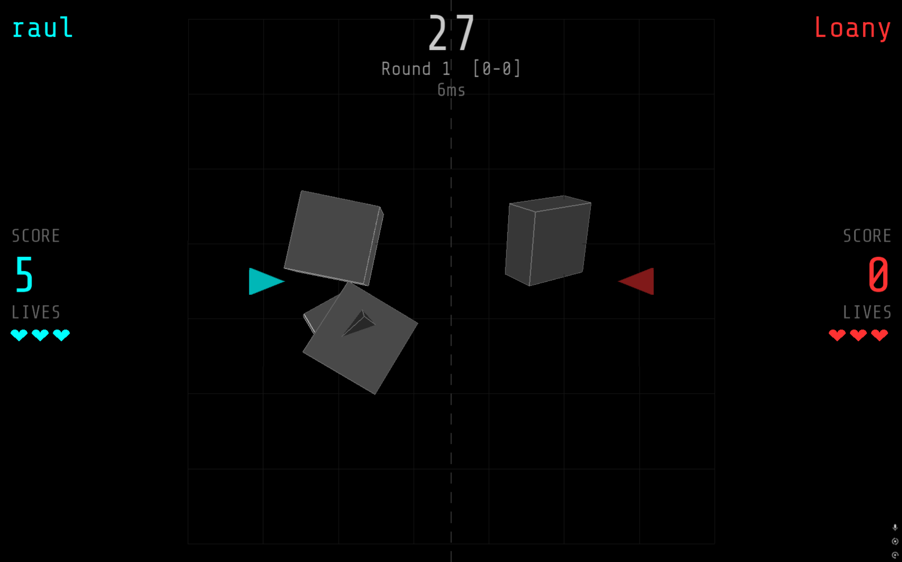

# ASTEROID 3D



A 1v1 LAN multiplayer 3D Asteroids game built with C++, SDL2, and legacy OpenGL...

A 1v1 LAN multiplayer 3D Asteroids game built with C++, SDL2, and legacy OpenGL. Made as a final project for the **Real-Time Computer Graphics** course at **Uppsala University – Campus Gotland** (Spring 2026).

<!-- TODO: Add a gameplay GIF or screenshot here -->
<!--  -->

## What is this?

Two players connect over a local network, each controlling a ship in a shared 3D arena. Shoot asteroids for points, shoot each other to steal lives, and survive — best of 3 rounds wins the match.

The game runs a host-authoritative networking model over TCP, with a lightweight Python relay server handling message forwarding between clients.

## Features

- **1v1 LAN Multiplayer** — host/join lobby system with IP-based connection, nickname exchange, ready-up flow, and rematch voting
- **3-Tier Asteroid System** — large asteroids split into medium, medium into small, small are destroyed (classic Asteroids behavior)
- **Best-of-3 Rounds** — 30-second timed rounds with score and elimination-based win conditions
- **Host-Authoritative Networking** — host runs all game logic; joiner receives state updates at 30 Hz with local visual interpolation to keep rendering smooth
- **Full Game State Machine** — main menu → nickname → lobby → playing → round end → match end, with clean transitions and disconnect handling
- **HUD** — per-player nicknames, scores, lives (drawn as hearts), round timer, round counter, and live ping display
- **Collision Substeps** — projectile-vs-asteroid and projectile-vs-player collisions use up to 20 substeps per frame to prevent tunneling at high projectile speeds
- **Disconnect Detection** — if either player leaves mid-game, the remaining player sees "[name] left the game!" and wins automatically
- **Rematch System** — after a match, both players can vote to rematch without re-entering IPs or restarting the server
- **TCP\_NODELAY** — enabled on both client and server to minimize latency spikes from Nagle's algorithm

## Tech Stack

| Component | Technology |
|-----------|-----------|
| Language | C++ (Visual Studio 2022, x64) |
| Graphics | SDL2 2.0.12 + Legacy OpenGL (fixed-function pipeline, GLU) |
| Text Rendering | SDL2\_ttf (Share Tech Mono font, SIL license) |
| Networking | Winsock2 (TCP), std::thread, std::mutex, std::atomic |
| Server | Python 3 (TCP relay, ~80 lines) |
| Build | Visual Studio .sln, Debug x64 |

## Controls

| Key | Action |
|-----|--------|
| W | Thrust forward |
| A / D | Rotate left / right |
| Space | Shoot |
| ESC | Back to menu / Quit |

## How to Build and Run

### Prerequisites
- Windows 10/11 (x64)
- Visual Studio 2019 or 2022 with "Desktop development with C++" workload
- Python 3.x (for the relay server)

### Steps

1. Clone the repository
2. Open `Project/Project.sln` in Visual Studio
3. Set configuration to **Debug | x64**
4. Build and run (Ctrl+F5)

### Starting a Multiplayer Game

1. One player runs `start_server.bat` (or `python server.py` from the project directory)
2. That player opens the game → enters nickname → selects **HOST GAME** → sees their local IP
3. The other player (on the same network) opens the game → enters nickname → selects **JOIN GAME** → types the host's IP → presses Enter
4. Both players click **READY**, then the host clicks **START MATCH**

> **Note:** University/corporate WiFi (e.g., eduroam) typically blocks peer-to-peer connections. Use a phone hotspot or Tailscale VPN as a workaround.

## Project Structure

```
Project/
├── Project.sln
├── server.py              ← Python TCP relay server
├── start_server.bat       ← Double-click to start server
├── Project/
│   ├── Main.cpp           ← SDL event loop, input handling
│   ├── Game.cpp           ← Game logic, rendering, state machine, HUD
│   ├── Game.h             ← Game class definition
│   ├── Constants.h        ← Gameplay tuning values
│   ├── Entities.h         ← Player, Asteroid, Projectile, GameState structs
│   ├── network.cpp        ← Winsock2 TCP client, send/recv, ping
│   ├── network.h          ← Network API declarations
│   └── fonts/             ← Share Tech Mono (SIL Open Font License)
├── SDL2-2.0.12/           ← Bundled SDL2 (headers + x64 libs)
└── SDL2_ttf/              ← Bundled SDL2_ttf
```

## Architecture

```
┌──────────┐     TCP      ┌──────────────┐     TCP      ┌──────────┐
│  HOST    │◄────────────►│ Python Relay  │◄────────────►│  JOINER  │
│ (Player 0)│   state@30Hz │   Server     │  input@30Hz  │ (Player 1)│
│          │              │  (forward     │              │          │
│ Runs all │              │   messages)   │              │ Visual   │
│ game     │              │              │              │ interp   │
│ logic    │              └──────────────┘              │ only     │
└──────────┘                                            └──────────┘
```

- **Host** runs physics, collisions, spawning, and scoring. Sends full game state (players, asteroids, projectiles) to joiner at 30 Hz.
- **Joiner** sends input at 30 Hz. Runs local position interpolation for smooth visuals but applies server state as authoritative when received.
- **Server** is a stateless relay — it accepts two TCP connections, assigns player IDs, sends START, then forwards all messages between them.

## Network Protocol

Newline-delimited JSON over TCP. Message types:

| Type | Direction | Purpose |
|------|-----------|---------|
| `player_id` | Server → Client | Assign player index (0 or 1) |
| `status: START` | Server → Client | Both players connected, begin |
| `nickname` | Client ↔ Client | Exchange display names |
| `ready` | Client ↔ Client | Ready-up signal |
| `input` | Joiner → Host | Thrust, rotate, shoot flags |
| `state` | Host → Joiner | Full game state + entity lists |
| `ping` / `pong` | Client ↔ Client | Latency measurement |
| `rematch` | Client ↔ Client | Rematch vote |

## Team

| Member | Contributions |
|--------|--------------|
| **Okan Ozcan** | Game architecture, state machine, all C++ game code (gameplay, HUD, menus, lobby, collision, input), SDL2\_ttf integration, network client (Winsock2), Git repository setup |
| **Marius-Raul Filipiuc** | Python relay server, Winsock2 networking layer, network protocol design |

## What This Project Demonstrates

- Working with **legacy OpenGL** (immediate mode, GLU) for 3D rendering
- Implementing a **real-time multiplayer game loop** with host-authoritative networking over TCP
- **State machine** design for managing game flow across multiple screens
- **Collision detection** with substep interpolation to handle fast-moving objects
- Thread-safe **concurrent programming** with `std::atomic` and `std::mutex` for network I/O
- Practical problem-solving around **NAT/firewall issues** on university networks

## Known Limitations

- TCP adds inherent latency compared to UDP — acceptable for LAN but not suitable for WAN play
- No client-side prediction for the joiner — movements can feel slightly delayed on high-latency connections
- Asteroids are rendered as wireframe cubes (stylistic choice, not a bug)
- Server must be restarted if both players disconnect simultaneously in some edge cases

## Future Improvements

- UDP networking for lower latency
- Client-side prediction and reconciliation
- Sound effects (shoot, explosion, hit)
- Particle effects for asteroid destruction
- In-game pause menu
- Matchmaking with lobby codes instead of raw IPs

## License

SDL2 is licensed under the [zlib license](https://www.libsdl.org/license.php). SDL2\_ttf under the same. Share Tech Mono font under the SIL Open Font License. Game code is by the authors listed above. Course template by Mikael Fridenfalk.